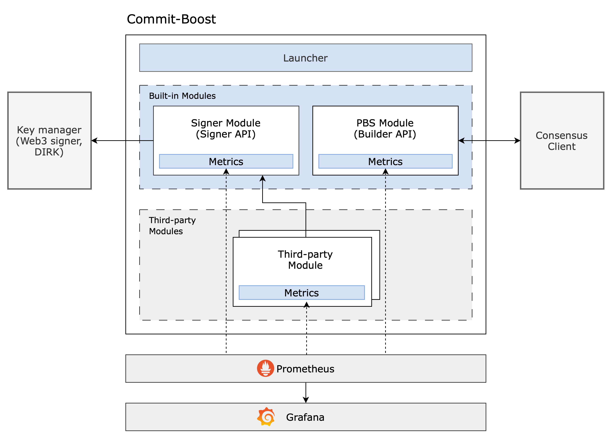

# Commit-Boost

## Dependencies

- Docker Desktop v4.29 or later. We are using the `host` network driver on docker container instantiation, so our client needs to support the feature.

## Usage
Note: Ensure that the ports used by the docker-compose are set up in the config.toml are not already in use by other processes and are not blocked by a firewall

First, initialize the submodule with:
```bash
git submodule update --init --recursive
```

Then, build and run the grafana and prometheus docker containers with:
```bash
docker-compose build
docker-compose up -d
```

Finally, run the project with:
```bash
cargo run --bin commit-boost -- start config.example.toml
```

## Configurations
All configurable settings can be found in config.example.toml file. 

### Note
- THIS IS JUST A PROOF OF CONCEPT TO ILLUSTRATE DESIGN PRINCIPLES, THERE ARE STILL COUNTLESS DECISIONS AND ASSUMPTION ON THE DESIGN THAT NEED TO BE MADE
- The code is unaudited and are from being / NOT ready for production
- Orginally proposed on ETH Research, read more [here](https://ethresear.ch/t/based-proposer-commitments-ethereum-s-marketplace-for-proposer-commitments/19517)
- First presentation to the community can be found [here](https://www.youtube.com/watch?v=jrm4ZUoj9xY&list=PLJqWcTqh_zKHDFarAcF29QfdMlUpReZrR&index=11)
- Second presentation at zuBerlin can be found [here](https://streameth.org/zuberlin/watch?session=66681afef9b8e98b1ec95fdd)
- zuBerlin Devnet notion can be found [here](https://twisty-wednesday-4be.notion.site/ZuBerlin-Preconfs-Devnet-b693047f41e7407cadac0170a6711dea)
- The efforts behind Commit-Boost will be from the broader community with core contributors / coordinators sitting in a not-for-profit type entity with a single focus: help develop and sustain this software

## Contributors:
- Daniel, Drew, George, George, Kubi, Kydo, Lorenzo ... Many more coming

## Background:

Nearly half a decade ago, Flashboys 2.0 was published highlighting how arbitrage bots were challenging the promise of blockchains. On the back of this, some of the authors and community members started a research collective to provide solutions to tackle these challenges. In the end, these efforts created a product more broadly known as MEV-boost.

MEV-boost is a middleware that allows the proposer to make a wholesale commitment that outsources block building to a sophisticated actor called a block builder. In return, these block builders pack a block to earn the highest fee for the proposer. Today, over 90% of blocks are built with proposer commitments.

## Proposer Commitments:

On the back of a few developments and some research by the EF, the concept of proposer commitments has begun to be more commonly discussed spurring the question; could proposers make commitments that would unlock a significant design space for Ethereum? And, could this be a mechanism to allow validators “…to provide input into block production, even when they decide to delegate building.” In the last year, multiple proposals have come forward that rely on or could greatly benefit from proposer commitments, some examples include:

- Inclusion lists: Proposer commitment where part of the block / a set of transactions will be included / can’t be censored or removed by a third party, including the proposer
- Preconf: Proposer commitment to in advance, guarantee inclusion of data / certain transaction or group of transactions in a block
- Partial block auctions: Proposer commitment to auction off the top-of-block and the rest-of-block
- Blockspace / blob futures: Proposer commitment to sell part of their block now, but deliver that part of the block in the future

The proposals range in complexity but are underpinned by the same simple idea–a proposer’s commitment to do something with or for a third party. We also note that proposers may not need to make commitments at this level of granularity (i.e., continue to use wholesale block auctions). However, we believe this is an avenue worth exploring as it may help preserve things like chain neutrality “by allowing them to provide input into block production, even when they decide to delegate building” and if they choose, give some autonomy back to the proposer.

## Challenge:

On the surface, this all seems great and is an incredibly exciting development. But, in the undercurrents, we are potentially on a perilous path if we can’t agree on a standard of how proposers register and make / receive commitments. We see multiple risks including, but not limited to:

- Increased fragmentation: While diversity of standards can create unlock more innovation, multiple standards (particularly in the last mile of communication) could compromise the security integrity of the entire Ethereum network through fragmentation of how proposer commitment protocols speak to proposers (i.e., proposers may need to make client adjustments for each variation of proposer commitments)
- Development complexity: If there is no standard, teams may more commonly make client adjustments to opt into proposer commitments. This could exponentially inflate the burden on core developers tasked with executing / testing major network upgrades increasing risks for the network around hard forks
- Limited transparency: With multiple software and standards, transparency around what proposers are opting into as well as bugs and taking quick actions may be challenging when something does go wrong
These risks are likely to only increase as more and more proposer commitments get proposed and adopted. We also note that longer-term there are potential ideas to enshrine various mechanisms helping to reduce these risks.

To help address this we started an open source community effort called "Commit-Boost". 

## What is Commit-Boost?
- Open source public good that is backwards compatible to help standardize the communication mechanism for the last mile of proposers’ commitments. 
- The goal is to develop and then sustain a standard software that will limit fragmentation, reduce complexity for core devs, and decrease risks for proposers making commitments–but, still allow for open innovation / not limiting designs developed by proposer commitment protocols
- Specifically, Commit-Boost is a new Ethereum validator sidecar focused on standardizing the last mile of communication between validators and third parties. It has been designed with modularity at its core, with the goal of supporting a broad range of different use cases and protocols.

## Goals
- **Open Source**: Developed in the open and under open-source licensing 
- **Optionality**: Ensure that the final design does not limit innovation or ossify certain downstream stakeholders / proposer commitments
- **Safety**: Thoroughly tested and audited, with full backwards compatibility with previous clients 
- **Modularity**: Allow developers and protocol teams to easily test, iterate, and deploy new protocols and software for proposer commitments without needing to implement everything from scratch 
- **Observability**: Allow node operators to collect and quickly analyze detailed telemetry about sidecar services 
- **Transparency**: Provide open access and good documentations to allow maximal verifiability and ease of integration

## Developing
With Commit-Boost you can:
- Spin up a Commit Module, requesting arbitrary signatures from the proposer (`examples/da_commit.rs`)
- Extend or replace the default BuilderApi implementation (`examples/custom_boost.rs`)
- Subscribe to BuilderApi events and trigger arbitrary pipelines (`examples/alert_hook.rs`)

### High-level architecture
By default, Commit-Boost will start a [MEV-boost](https://github.com/flashbots/mev-boost) compatible service. If any commit module is registered, then a signing manager is also started. The signing manager abstracts away the different signing methods and keystores.



## Roadmap
- [ ] Detailed telemetry and logging
- [ ] Support for additional key managers (web3, ERC-2335, keystores, proxy)
- [ ] Increased modularity of services, including in-process monitoring and extensive configurability

## Acknowledgements
- [MEV boost](https://github.com/flashbots/mev-boost)
- [Reth](https://github.com/paradigmxyz/reth)
- [Lighthouse](https://github.com/sigp/lighthouse)

## License
MIT + Apache-2.0
