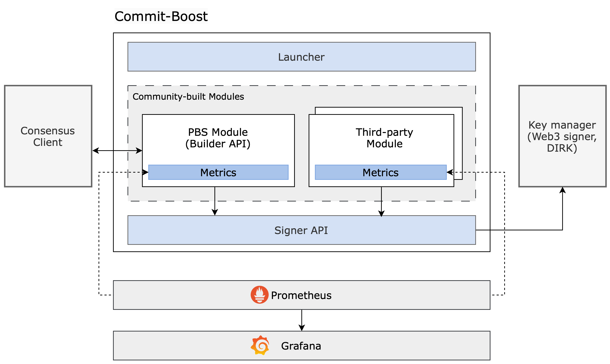

# Core Commit-Boost
Below is a schematic of Commit-Boost. This proposed architecture allows proposers to run one sidecar, but still retain the ability to opt into a network of proposer commitment modules. More specifically, with this middleware, the proposer will only need to (in the case of delegation) run one sidecar and limits their responsibilities to only selecting which module / proposer commitment protocol they would like to subscribe to.

It is important to note that the below depiction contains just a few examples of proposer commitment modules that can run on Commit-Boost. The design space for modules is completely open / not gated by the Commit-Boost software. The Commit-Boost software also does not come with modules (these are developed by teams outside of the Commit-Boost software), proposers will be responsible for opting into the commitments they wish to subscribe to (i.e., a proposer is responsible for which modules they will subscribe to).

Using this as a middleware instead of direct modification to the consensus client or running a sidecar per commitment will allow for each component to be sustained independently and will provide for cross proposer commitment compatibility.