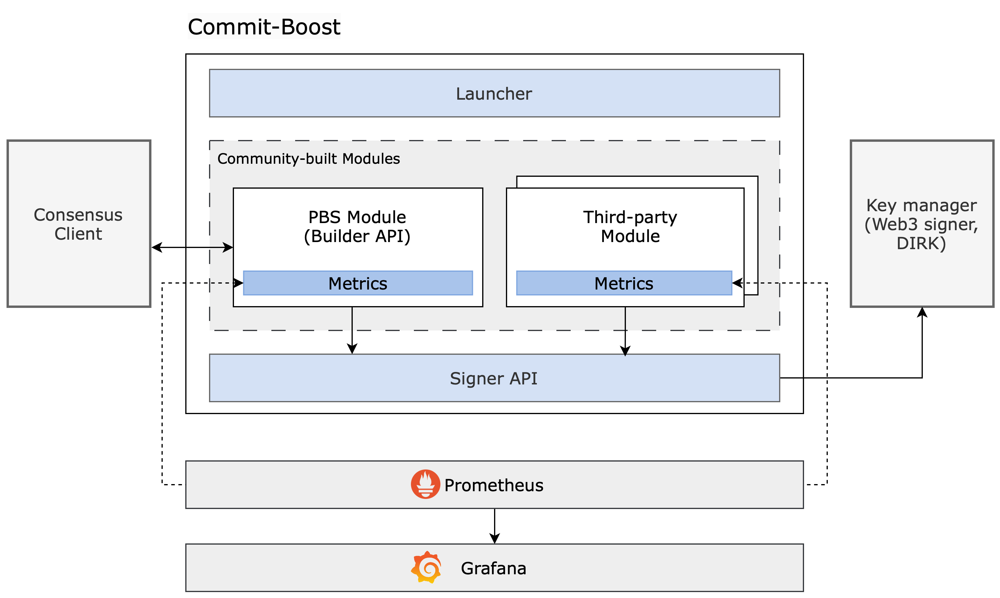

# Overview

Below is a schematic overview of Commit-Boost.

Commit-Boost runs as a single sidecar composed of multiple modules:
- Pbs Module with the [BuilderAPI](https://ethereum.github.io/builder-specs/) for [MEV Boost](https://docs.flashbots.net/flashbots-mev-boost/architecture-overview/specifications)
- A Signer Module implementing the SignerAPI
- Commit Modules that implement some custom commit protocol logic
- Telemetry modules like Prometheus and Grafana

