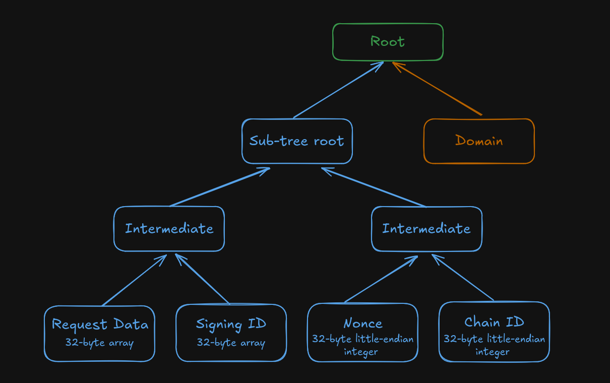

# Requesting Proposer Commitment Signatures with Commit-Boost

When you create a new validator on the Ethereum network, one of the steps is the generation of a new BLS private key (commonly known as the "validator key" or the "signer key") and its corresponding BLS public key (the "validator pubkey", used as an identifier). Typically this private key will be used by an Ethereum consensus client to sign things such as attestations and blocks for publication on the Beacon chain. These signatures prove that you, as the owner of that private key, approve of the data being signed. However, as general-purpose private keys, they can also be used to sign *other* arbitrary messages not destined for the Beacon chain.

Commit-Boost takes advantage of this by offering a standard known as **proposer commitments**. These are arbitrary messages (albeit with some important rules), similar to the kind used on the Beacon chain, that have been signed by one of the owner's private keys. Modules interested in leveraging Commit-Boost's proposer commitments can construct their own data in whatever format they like and request that Commit-Boost's **signer service** generate a signature for it with a particular private key. The module can then use that signature to verify the data was signed by that user.

Commit-Boost supports proposer commitment signatures for both BLS private keys (identified by their public key) and ECDSA private keys (identified by their Ethereum address).

## Rules of Proposer Commitment Signatures

Proposer commitment signatures produced by Commit-Boost's signer service conform to the following rules:

- Signatures are **unique** to a given EVM chain (identified by its [chain ID](https://chainlist.org/)). Signatures generated for one chain will not work on a different chain.
- Signatures are **unique** to Commit-Boost proposer commitments. The signer service **cannot** be used to create signatures that could be used for other applications, such as for attestations on the Beacon chain. While the signer service has access to the same validator private keys used to attest on the Beacon chain, it cannot create signatures that would get you slashed on the Beacon chain.
- Signatures are **unique** to a particular module. One module cannot, for example, request an identical payload as another module and effectively "forge" a signature for the second module; identical payloads from two separate modules will result in two separate signatures.
- The data payload being signed must be a **32-byte array**, typically serializd as a 64-character hex string with an optional `0x` prefix. The value itself is arbitrary, as long as it has meaning to the requester - though it is typically the 256-bit hash of some kind of data.
- If requesting a signature from a BLS key, the resulting signature will be a standard BLS signature (96 bytes in length).
- If requesting a signature from an ECDSA key, the resulting signature will be a standard Ethereum RSV signature (65 bytes in length).
- Signatures **may** be **unique** per request, using the optional `nonce` field in their requests to indicate a unique sequence that this signature belongs to.

## Configuring a Module for Proposer Commitments

Commit-Boost's signer service must be configured prior to launching to expect requests from your module. There are two main parts:

1. An entry for your module into [Commit-Boost's configuration file](../get_started/configuration.md#custom-module). This must include a unique ID for your module, the line `type = "commit"`, and include a unique [signing ID](#the-signing-id) for your module. Generally you should provide values for these in your documentation, so your users can reference it when configuring their own Commit-Boost node.

2. A JWT secret used by your module to authenticate with the signer in HTTP requests. This must be a string that both the Commit-Boost signer can read and your module can read, but no other modules should be allowed to access it. The user should be responsible for determining an appropriate secret and providing it to the Commit-Boost signer service securely; your module will need some way to accept this, typically via a command line argument that accepts a path to a file with the secret or as an environment variable.

Once the user has configured both Commit-Boost and your module with these settings, your module will be able to authenticate with the signer service and request signatures.

## The Signing ID

Your module's signing ID is a 32-byte value that is used as a unique identifier within the signing process. Proposer commitment signatures incorporate this value along with the data being signed as a way to create signatures that are exclusive to your module, so other modules can't maliciously construct signatures that appear to be from your module. Your module must have this ID incorporated into itself ahead of time, and the user must include this same ID within their Commit-Boost configuration file section for your module. Commit-Boost does not maintain a global registry of signing IDs, so this is a value you should provide to your users in your documentation.

The Signing ID is decoupled from your module's human-readable name (the `module_id` field in the Commit-Boost configuration file) so that any changes to your module name will not invalidate signatures from previous versions. Similarly, if you don't change the module ID but *want* to invalidate previous signatures, you can modify the signing ID and it will do so. Just ensure your users are made aware of the change, so they can update it in their Commit-Boost configuration files accordingly.

## Nonces

Your module has the option of using **Nonces** for each of its signature requests. Nonces are intended to be unique values that establish a sequence of signature requests, distinguishing one signature from another - even if all of their other payload information is identical. When making a request for a signature, you may include a unique nonce as part of the request; the signature will include it in its data, ensuring that things like replay attacks cannot be used for that signature.

If you want to use them within your module, your module (or whatever remote backend system it connects to) **will be responsible** for storing, comparing, validating, and otherwise using the nonces. Commit-Boost's signer service by itself **does not** store nonces or track which ones have already been used by a given module.

In terms of implementation, the nonce format conforms to the specification in [EIP-2681](https://eips.ethereum.org/EIPS/eip-2681). It is an unsigned 64-bit big-endian integer, with a minimum value of 0 and a maximum value of `2^64-2`. We recommend using `2^64-1` as a signifier indicating that your module doesn't use nonces, rather than using 0 for such a purpose.

## Structure of a Signature

The form proposer commitment signatures take depends on the type of signature being requested. BLS signatures take the [standard form](https://eth2book.info/latest/part2/building_blocks/signatures/) (96-byte values). ECDSA (Ethereum EL) signatures take the [standard Ethereum ECDSA `r,s,v` signature form](https://forum.openzeppelin.com/t/sign-it-like-you-mean-it-creating-and-verifying-ethereum-signatures/697). In both cases, the data being signed is a 32-byte hash - the root hash of a composite two-stage [SSZ Merkle tree](https://thogiti.github.io/2024/05/02/Merkleization.html), described below:

where, for the sub-tree in blue:

- `Request Data` is a 32-byte array that serves as the data you want to sign. This is typically a hash of some more complex data on its own that your module constructs.

- `Signing ID` is your module's 32-byte signing ID. The signer service will load this for your module from its configuration file.

- `Nonce` is the nonce value for the signature request. While this value must be present, it can be effectively ignored by setting it to some arbitrary value if your module does not track nonces. Conforming with the tree specification, it must be added as a 256-bit unsigned little-endian integer. Most libraries will be able to do this conversion automatically if you specify the field as the language's primitive for 64-bit unsigned integers (e.g., `uint64`, `u64`, `ulong`, etc.).

- `Chain ID` is the ID of the chain that the Signer service is currently configured to use, as indicated by the [Commit-Boost configuration file](../get_started/configuration.md). This must also be a 256-bit unsigned little-endian integer.

A Merkle tree must be constructed from these four leaf nodes, and its root hash calculated according to the standard SSZ hash computation rules. This result will be called the "sub-tree root". With this, a second Merkle tree is created using this sub-tree root and a value called the Domain:

- `Domain` is the 32-byte output of the [compute_domain()](https://eth2book.info/capella/part2/building_blocks/signatures/#domain-separation-and-forks) function in the Beacon specification. The 4-byte domain type in this case is not a standard Beacon domain type, but rather Commit Boost's own domain type: `0x6D6D6F43`.

The data signed in a proposer commitment is the 32-byte hash root of this new tree (the green `Root` box).

Many languages provide libraries for computing the root of an SSZ Merkle tree, such as [fastssz for Go](https://github.com/ferranbt/fastssz) or [tree_hash for Rust](https://docs.rs/tree_hash/latest/tree_hash/). When verifying proposer commitment signatures, use a library that supports Merkle tree root hashing, the `compute_domain()` operation, and validation for signatures generated by your key of choice.
