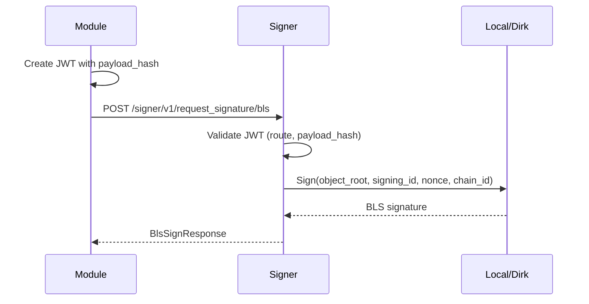
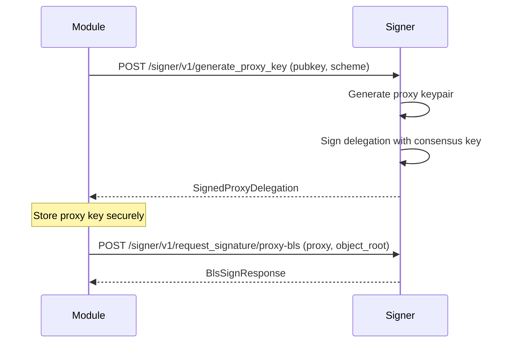

# Signer API

The Signer Service exposes an HTTP API that commit modules use to request proposer commitment signatures. All requests pass through the signer service's middleware, which validates authentication and routes the request to the appropriate signing backend (local keystore or [Dirk](https://github.com/attestantio/dirk)).

The Signer Service listens on the port configured by `signer.port` in `cb-config.toml` (default: `20000`).

For the Merkle tree structure that underlies every proposer commitment signature, see [Requesting Proposer Commitment Signatures](./prop-commit-signing.md#structure-of-a-signature).

---

## Authentication

Every request (except the health-check endpoint) must present a Bearer token in the `Authorization` header.

### Module JWT

Modules authenticate with a **signed JWT** using the pre-shared secret (`CB_SIGNER_JWT`). The JWT is an HS256 token with the following claims:

| Claim | Type | Required | Description |
|-------|------|----------|-------------|
| `module` | string | always | The module's `id` from the `[[modules]]` entry in `cb-config.toml`. |
| `route` | string | always | The exact request path, e.g. `/signer/v1/get_pubkeys`. |
| `exp` | integer | always | UNIX timestamp for when the token expires. |
| `payload_hash` | string | POST only | Keccak-256 hash of the JSON-encoded request body, with `0x` prefix. Not required for GET requests — the middleware skips `payload_hash` validation when there is no body. |

The `payload_hash` claim prevents JWT replay attacks: a token issued for one POST request body cannot be reused with a different body on the same route.

**Lifecycle:**

- Expiry is controlled by the `SIGNER_JWT_EXPIRATION` environment variable (default from the `commit-boost` crate's constant).
- **Refresh is client-side.** There is no refresh endpoint. The module generates a new JWT locally using the pre-shared secret. The SDK's `SignerClient::refresh_token()` handles this automatically — in production, use the SDK rather than crafting JWTs manually.

### Admin token

Administrative endpoints (`/reload`, `/revoke_jwt`) authenticate with a **separate JWT** signed with the `CB_SIGNER_ADMIN_JWT` secret. The admin JWT uses the same HS256 algorithm and includes `admin: true` in its claims, plus `route` and `exp` and optionally `payload_hash`.

The admin JWT secret is configured via the `CB_SIGNER_ADMIN_JWT` environment variable.

### Rate limiting

The signer service rate-limits clients that accumulate too many failed authentication attempts. By default, **3 failed authentications within 5 minutes** locks a client out. These values can be modified in the `[signer]` section of `cb-config.toml`:

```toml
[signer]
jwt_auth_fail_limit = 3
jwt_auth_fail_timeout_seconds = 300
```

The rate limit is applied per IP address. If running behind a reverse proxy, configure the [reverse proxy header setup](../get_started/configuration.md#rate-limit) so the correct client IP is extracted.

---

## Quickstart

### 1. Get a JWT

An easy way to get a valid module JWT is to inspect the logs after the signer starts (the config output shows the configured modules and JWT secrets), or generate one locally:

```bash
# Generate a JWT valid for 1 hour for module MY_MODULE
python3 -c "
import jwt, time
claims = {
    'module': 'MY_MODULE',
    'route': '/signer/v1/get_pubkeys',
    'exp': int(time.time()) + 3600
}
print(jwt.encode(claims, 'my-secret', algorithm='HS256'))
"
```

### 2. List available pubkeys (GET — no body)

Since `GET /signer/v1/get_pubkeys` has no request body, no `payload_hash` is needed in the JWT:

```bash
export JWT='<token-from-step-1>'
curl -H "Authorization: Bearer $JWT" http://localhost:20000/signer/v1/get_pubkeys
```

Example response:

```json
{
  "keys": [
    {
      "consensus": "0xa3366b54f28e4bf1461926a3c70cdb0ec432b5c92554ecaae3742d33fb33873990cbed1761c68020e6d3c14d30a22050",
      "proxy_bls": [],
      "proxy_ecdsa": []
    }
  ]
}
```

### 3. Request a signature (POST — requires payload_hash)

For POST endpoints, the JWT must include a `payload_hash` claim that matches the Keccak-256 hash of the JSON-encoded request body. Use a two-step pattern: generate a token with the correct hash, then use it in the request.

**Save this as `gen-jwt.sh`:**

```bash
#!/usr/bin/env bash
python3 -c "
import json, eth_hash, jwt, time

body = json.dumps({'pubkey': '0x...', 'object_root': '0x...', 'nonce': 0})
payload_hash = '0x' + eth_hash.keccak256(body.encode()).hex()
claims = {
    'module': 'MY_MODULE',
    'route': '/signer/v1/request_signature/bls',
    'exp': int(time.time()) + 3600,
    'payload_hash': payload_hash
}
print(jwt.encode(claims, 'my-secret', algorithm='HS256'))
"
```

Then send the request:

```bash
curl -X POST \
  -H "Authorization: Bearer $(./gen-jwt.sh)" \
  -d '{"pubkey":"0x...","object_root":"0x...","nonce":0}' \
  http://localhost:20000/signer/v1/request_signature/bls
```

**In production**, use the SDK's `SignerClient`, which handles JWT lifecycle (creation, payload hashing, refresh) automatically. See the [Commit Module guide](./commit-module.md#requesting-signatures) for SDK examples.

---

## Module endpoints

These endpoints are available to commit modules and require a **module JWT** (`jwt_auth` middleware).

| Method | Path | Auth | Description |
|--------|------|------|-------------|
| `GET` | `/signer/v1/get_pubkeys` | Module JWT | List available validator pubkeys and their proxy keys |
| `POST` | `/signer/v1/generate_proxy_key` | Module JWT | Create a BLS or ECDSA proxy key for a consensus pubkey |
| `POST` | `/signer/v1/request_signature/bls` | Module JWT | Sign data with a consensus BLS key |
| `POST` | `/signer/v1/request_signature/proxy-bls` | Module JWT | Sign data with a proxy BLS key |
| `POST` | `/signer/v1/request_signature/proxy-ecdsa` | Module JWT | Sign data with a proxy ECDSA key |

### GET /signer/v1/get_pubkeys

Returns all consensus validator public keys the signer has loaded, along with any proxy keys that have been generated for each consensus key.

**Response:**

```json
{
  "keys": [
    {
      "consensus": "0x<96-hex-chars>",
      "proxy_bls": ["0x<96-hex-chars>", "..."],
      "proxy_ecdsa": ["0x<40-hex-chars>", "..."]
    }
  ]
}
```

### POST /signer/v1/generate_proxy_key

Generates a new proxy keypair for the given consensus pubkey and scheme. The proxy key is authorised by the consensus key via a signed delegation.

**Request body:**

```json
{
  "pubkey": "0x<96-hex-chars>",
  "scheme": "bls"
}
```

`scheme` must be `"bls"` or `"ecdsa"`.

**Response (BLS example):**

```json
{
  "message": {
    "delegator": "0x<96-hex-chars>",
    "proxy": "0x<96-hex-chars>"
  },
  "signature": "0x<192-hex-chars>"
}
```

**Response (ECDSA example):**

```json
{
  "message": {
    "delegator": "0x<96-hex-chars>",
    "proxy": "0x<40-hex-chars>"
  },
  "signature": "0x<192-hex-chars>"
}
```

### POST /signer/v1/request_signature/bls

Signs a 32-byte `object_root` with the BLS key corresponding to the given consensus pubkey.

**Request body:**

```json
{
  "pubkey": "0x<96-hex-chars>",
  "object_root": "0x<64-hex-chars>",
  "nonce": 0
}
```

**Response:**

```json
{
  "pubkey": "0x<96-hex-chars>",
  "object_root": "0x<64-hex-chars>",
  "module_signing_id": "0x<64-hex-chars>",
  "nonce": 0,
  "chain_id": 1,
  "signature": "0x<192-hex-chars>"
}
```

### POST /signer/v1/request_signature/proxy-bls

Same semantics as BLS consensus signing, but uses a **proxy BLS key** created via `generate_proxy_key` with `scheme: "bls"`.

**Request body:**

```json
{
  "proxy": "0x<96-hex-chars>",
  "object_root": "0x<64-hex-chars>",
  "nonce": 0
}
```

Response has the same shape as `/request_signature/bls`.

### POST /signer/v1/request_signature/proxy-ecdsa

Uses a **proxy ECDSA key** created via `generate_proxy_key` with `scheme: "ecdsa"`. The request body specifies the proxy by its Ethereum address.

**Request body:**

```json
{
  "proxy": "0x<40-hex-chars>",
  "object_root": "0x<64-hex-chars>",
  "nonce": 0
}
```

**Response:**

```json
{
  "address": "0x<40-hex-chars>",
  "object_root": "0x<64-hex-chars>",
  "module_signing_id": "0x<64-hex-chars>",
  "nonce": 0,
  "chain_id": 1,
  "signature": "0x<130-hex-chars>"
}
```

:::tip
ECDSA proxy signing is not available when the signer is using the Dirk backend. Dirk only supports BLS operations.
:::

---

## Admin endpoints

These endpoints are available for administrative tasks. They are served on the same port as the module endpoints but authenticate with a **separate admin JWT** (`admin_auth` middleware) or, in the case of `/status`, no authentication.

| Method | Path | Auth | Description |
|--------|------|------|-------------|
| `POST` | `/reload` | Admin JWT | Reload signer configuration and optionally rotate secrets |
| `POST` | `/revoke_jwt` | Admin JWT | Revoke a module's access immediately |
| `GET` | `/status` | None | Health check |

### POST /reload

Hot-reloads the signer's configuration without restarting the process. The signer re-reads `cb-config.toml` and environment variables, then rebuilds its internal state:

- **New modules** added to the config are registered.
- **Removed modules** are dropped from the access list.
- **JWT secrets and admin secret** are reset to their current environment variable values.
- Any runtime changes from previous `/revoke_jwt` or `/reload` body overrides are reverted.

**Optional request body overrides** (applied on top of the config baseline):

```json
{
  "jwt_secrets": "module_a=newsecret,module_b=anothersecret",
  "admin_secret": "new-admin-secret"
}
```

| Field | Type | Description |
|-------|------|-------------|
| `jwt_secrets` | string | Comma-separated list of `<MODULE_ID>=<SECRET>` pairs. Only modules present in the config can be overridden. |
| `admin_secret` | string | Override for the admin JWT secret. |

**Response:** `200 OK` on success. `500` if the config could not be reloaded (previous state is preserved).

**Common patterns:**

1. **Add a new module without restarting:** Add the `[[modules]]` entry to `cb-config.toml`, set the module's JWT secret in the environment, then send `POST /reload` with an empty body.
2. **Rotate a JWT secret remotely:** Send `POST /reload` with the new secret in `jwt_secrets`. The module must already exist in the config.
3. **Revoke and later restore a module:** Use `/revoke_jwt` for immediate revocation, then `/reload` to restore if the module is still in the config.

**Footguns:**
- Body overrides are **not persisted**. If the signer restarts, it falls back to config/environment values. Update the environment variable to match after rotation.
- Override validation is **atomic**. If any referenced module ID does not exist in the config, the entire reload is rejected.

### POST /revoke_jwt

Immediately removes a module from the signer's access list. The module will no longer be able to authenticate with its JWT.

**Request body:**

```json
{
  "module_id": "MY_MODULE"
}
```

**Response:** `200 OK` if the module was found and removed. `404` if the module ID does not exist.

:::note
If the module is still present in `cb-config.toml`, the next `/reload` will re-add it. Remove the module from the config to make revocation permanent.
:::

### GET /status

Simple health check. Returns `200 OK` with no body. No authentication required.

---

## Error codes

All error responses follow a consistent JSON format:

```json
{
  "code": <http-status-code>,
  "message": "<human-readable description>"
}
```

| HTTP Status | Code | Meaning |
|-------------|------|---------|
| `400` | `bad request` | The request body is malformed, a pubkey format is invalid, the signing ID is missing from config, or the operation is not supported by the current backend (e.g. ECDSA proxy with Dirk). |
| `401` | `unauthorized` | Missing or invalid JWT. The token may be expired, signed with the wrong secret, or missing required claims. |
| `404` | `not found` | The requested consensus signer, proxy signer, or module ID does not exist. |
| `429` | `rate limited` | Too many failed authentication attempts — retry after the timeout period. |
| `500` | `internal error` | Something went wrong on the server side. The request was valid but could not be fulfilled. |
| `502` | `bad gateway` | The signer is running in Dirk mode but Dirk is unreachable. |

---

## Configuration reference

The signer service is configured in `cb-config.toml`. See the [Configuration](../get_started/configuration.md#signer-service) page for the full reference, including keystore formats, proxy key store, TLS, and Dirk setup.

---

## Common workflows

### Requesting a BLS consensus signature



### Generating and using a proxy key


