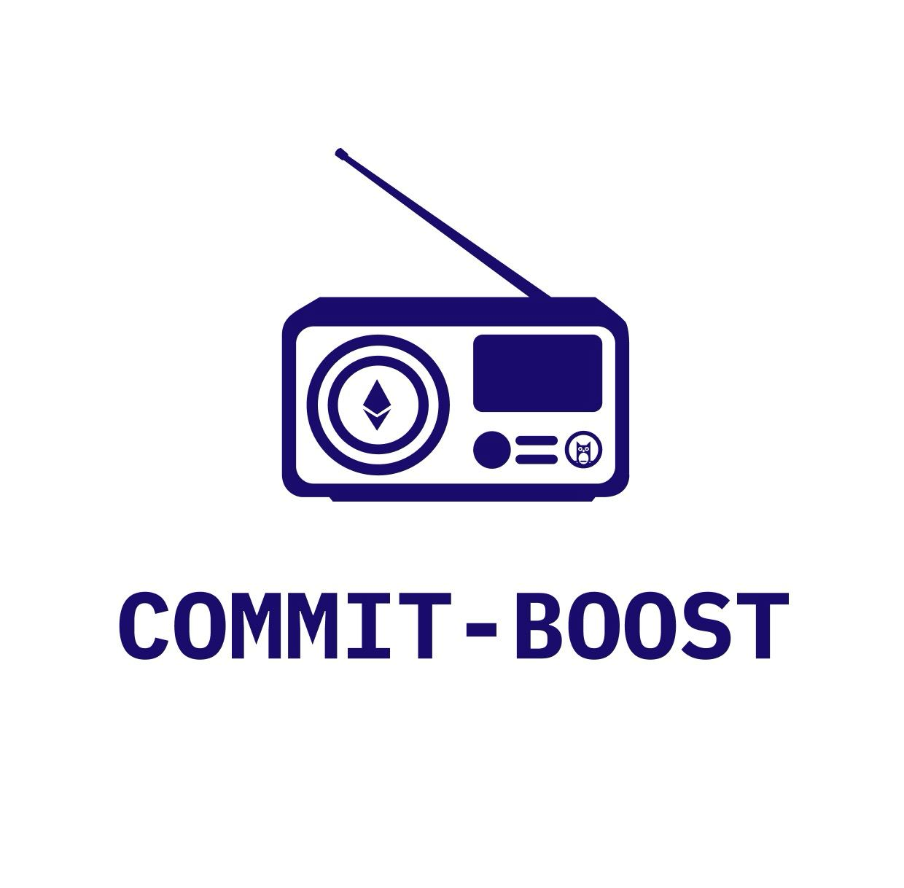

# Introduction

Commit-Boost is an open-source public good that is fully compatible with [MEV-Boost](https://github.com/flashbots/mev-boost), but acts as a light-weight validator platform to enable safe commitments. Specifically, Commit-Boost is a new Ethereum validator sidecar focused on standardizing the last mile of communication between validators and commitments. It has been designed with modularity at its core, with the goal of not limiting the range of different proposer commitments protocols and the open design space around those protocols. 

## Background
- Proposer commitments have been an important part of Ethereum’s history and could continue to be a powerful unlock for Ethereum
- Today, we already see the power of commitments where nearly 90% of validators currently make a wholesale commitment that outsources block building to a sophisticated actor called a block builder (facilitated by a software called MEV-Boost)
- However, a wholesale commitment gives away the proposer’s autonomy over the block. Many are starting to realize that if proposers could make more granular commitments, there is a significant design space and opportunity for Ethereum and its validators
- On the surface, all the efforts around proposer commitments are a unlock for Ethereum, with most starting to agree on a common denominator: in the future, validators will face a broader set of options of what they may “commit" to
- While this all seems great, the challenge is that this already is and will continue to drive fragmentation and risks for Ethereum and proposers
- Commit-Boost is aimed to standardize proposer commitment protocols communication with the proposer with unification behind one sidecar helping to reduce the risk of fragmentation

## What is Commit-Boost?
### From the perspective of the proposer:
- The Commit-Boost client is a single sidecar that acts as a platform to interact with proper commitment protocols
- Standardized way to provide a signature / opt into a commitment
- Helps monitor key attributes around that signature
- Creates constraints / condition sets and pass these constraints downstream
- Get insight to telemetry around the commitment flow and validator box that can be seen through dashboards such as a - Grafana
- Create bespoke process management logic to ensure safety when making commitments
### From the perspective of the proposer commitment protocol / module creator:
- Framework / standard request a to have a proposer make a commitment

## Table of Contents

1. [Introduction](introduction.md)
2. [Running As a Node Operator](running-as-node-operator.md)
3. [Developing a Custom Module](custom-module.md)
4. [Reference](reference.md)
5. [Acknowledgements](acknowledgements.md)